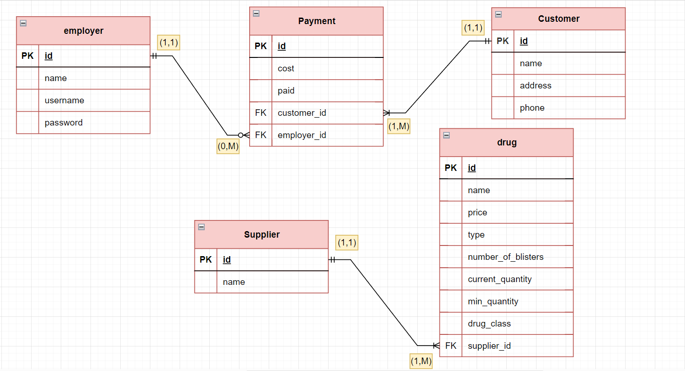

# Pharmcay
Pharmacy System builded with "Java"

1. cashier :
  - Consists of Friendly GUI to type Drugs IDs or names and customer ID if it's Delivery to display the total price (ID and Date are auto generated)
  - If the medicine not found it can get the alternative by accessing the usage group
2. Inventory :
  - Consists of a table consists of All the drugs
  - In each row the name of the medicine and it's type and the no. of blisters (the price depend on no. of blisters so the customer can tale an integer part of the blisters) and the manufacturer and the current and recommended quantity and it's usage to get the alternative if it's not found in the inventory (ID is auto generated)
3. Customers :
  - consists of customers and their points depend on the number of payments and their names, addresses and phone number (ID is auto generated) (payments are related to checks IDs)
4. Checks :
  - display all the payments in a table
  - in each row the payement ID and the Customer name if it's founded and the total price and the date
  - can display payments of specific range and it's total revenue
5. Reoprts and Analytics :
  - generate auto reports consists of :
    1. revenu : revenu to specific range
    2. Quantity of drugs : table consists of reporting about the medicine which current quantity under the recommended one
    3. Best Seller Medicines : consist of the top 10 (Number can Change) Medicines sold in the last time

## Database
Database of the system consists of 4 tables as shown in the figure :

## Medicine Table
this system rely on the following table of drugs
[Drug's Table](https://docs.google.com/spreadsheets/d/1u1fnSL-uNz0zvXHKjLGlzOhTFN_pTMDi6Mf_MPHXt3s/edit?usp=sharing).
